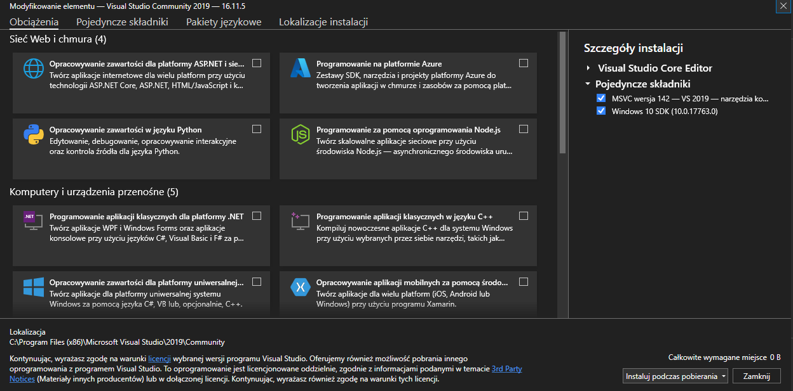
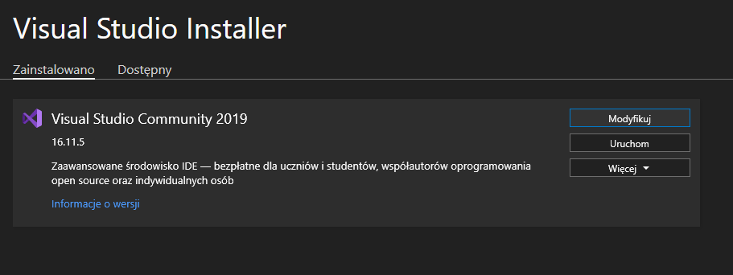
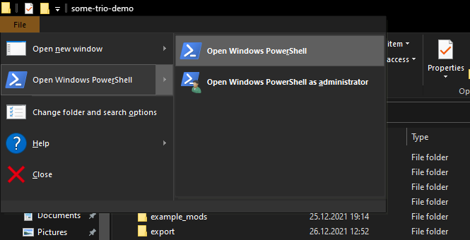

# Go to section:
- [Main](#Main)
- - [Running Hello World project in HaxeFlixel](#Running-Hello-World)
- - [Friday Night Funkin' instructions](#Friday-Night-Funkin-Instructions)
- [Optional](#Optional) (it's really helphul)
- [Other languages](#Other-languages)
- [Contributing/Adding guide languages](#Contributing)
- [Credits](#Credits)


# Main
Welcome to my guide, where I'll teach you how setup the installation of HaxeFlixel, so you can start programming your first HaxeFlixel project.
- Before you start your first HaxeFlixel project, you have to configure some things and do them one by one:
1. Install [Haxe](https://haxe.org/download/).
2. After you install **Haxe** (which is required), install [HaxeFlixel](https://haxeflixel.com/). Its installation is documented [here](https://haxeflixel.com/documentation/install-haxeflixel/). However if you want to do it more quickly, you can download Flixel via a single batchfile:
- - [Click for the raw file](https://raw.githubusercontent.com/teotm/friday-night-funkin-source-code-guide/main/batchFiles/1_haxe_commands_part_1.bat)
- - [Click to download instantly](https://cdn.discordapp.com/attachments/848938574254440468/983466914808496148/1_haxe_commands_part_1.bat)
- After you type `haxelib run flixel-tools setup` (or if it's gonna be typed instantly), type one by one these stuff: `y`, `3`, `y`. If everything is done correctly, then congrats! You have installed HaxeFlixel in your PC.


## Running Hello World
- Go check how to do it by [clickling here](https://haxeflixel.com/documentation/hello-world/).


## Friday Night Funkin' Instructions
Reading the [Main](#Main) section is required to do first, so you can move here.
1. If you're gonna be modding [Psych Engine](https://github.com/ShadowMario/FNF-PsychEngine) 0.5 or higher version via source coding, skip this step.
- Ohterwise, if you're gonna be using other engines like Kade Engine, download [Haxe 4.1.5](https://haxe.org/download/version/4.1.5/) instead.
- - Important note: If you have already installed Haxe that **is not** 4.1.5, you don't have to uninstall it. The version will update for you.
- - If you want to check your current Haxe version, just type this command below in your cmd. It will print your current Haxe version for you.
```cmd
haxe --version
```
2. Download `git-scm`, [here](https://git-scm.com/downloads). It will allow you to use Git commands.
3. If you downloaded HaxeFlixel and `git-scm`, go download the remaining Haxe(Flixel) libraries as well. This allows you to use commands with `git` and compile the game properly. Go use the batchfile I made to download the remaining Haxe libraries:
- [Raw](https://github.com/teotm/friday-night-funkin-source-code-guide/blob/main/batchFiles/2_haxe_commands_part_2.bat)
- [Instant download](https://cdn.discordapp.com/attachments/848938574254440468/983478736953430067/2_haxe_commands_part_2.bat)
4. Install/Reinstall [Visual Studio 2019](https://docs.microsoft.com/en-us/visualstudio/releases/2019/release-notes) community
- If you haven't installed Visual Studio 2019 and opened the installer, you should be here. 
- If you're reinstalling it, you should be here. While you're here, press the `Modify` button, if you do, you should be in the last image. 
- When you're here, at the top left corner should be tabs named: `Install workloads`, `Individual components` and the other shit, and click `Individual components`.
- While you're in individual components search these two (it takes 4 GB of space):
- - Windows SDK (10.0.17763.0)
- - MSVC v142 - VS 2019 C++ x64/x86 build tools
5. If you haven't already, download one of the repositories below on GitHub and extract the `.zip` file. While you're in the folder with the GitHub repository, you downloaded, open Windows PowerShell. 
- [Vanilla (normal Friday Night Funkin')](https://github.com/ninjamuffin99/Funkin)
- [Kade Engine](https://github.com/KadeDev/Kade-Engine)
- [Psych Engine](https://github.com/ShadowMario/FNF-PsychEngine)
6. While you're in Windows PowerShell type the command `lime test windows` or `lime test windows -debug`. If you're building your game for the first time, a folder `export` will be created. First game compilation will always take the longest, but it also depends if you're building for the first time the debug version or not (it may take an hour or two, or half of an hour).


# Optional
- You can also install [Visual Studio Code](https://code.visualstudio.com/download) with extensions
- Here is [Visual Studio Code](https://code.visualstudio.com/download) extensions installation guide **(Visual Studio 2019 and Visual Studio Code are not the same)**, it makes coding easier:
- 1. Open Visual Studio Code (doesn't matter if you open a file using it or not)
- 2. While having [Visual Studio Code](https://code.visualstudio.com/download) opened, click this button at the left 


- 3. Search these Visual Studio Code extensions (This will help you with programming with file extensions `.hx` and `.lua`.):
```
Haxe Extension Pack by Haxe Foundation
Lime by OpenFL
Lua by sumneko
```
If you open a file in Visual Studio Code, downloaded the extensions and the file is opened in restricted mode, add this folder with the repository, as trusted.

# Other languages:
- [Polska wersja/Polish vesrion](https://github.com/teotm/friday-night-funkin-source-code-guide/blob/main/otherLangs/polVesion/README.md).

# Contributing
Here is the information how you can contribute to the repository. If you want to, please follow the steps below if you have noticed any typos, misinformation or you just want to translate it.
1. Fork this repository
2. Translate or improve this guide
- If you noticed any typos or misinformations, just edit this file, so it will be more correct.
- However if you want to make a translation, make a new file and translate it.
3. Make a [pull request](https://github.com/teotm/friday-night-funkin-source-code-guide/pulls)

# Credits
- [teotm](https://www.youtube.com/channel/UCJnOkGILRMpEAgbS0A91cWQ) (me) - (Almost) everything pretty much
- [Kaskudek](https://www.youtube.com/channel/UCpkRxfWt_zcGw5C0Hu17Vkg) - Telling me how to make the batchfiles
